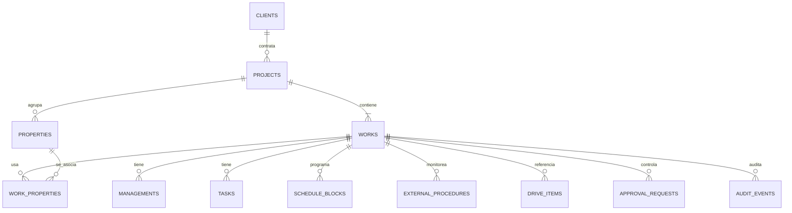

# Modelo de datos físico — Fase 2

Estado: **diseño físico implementado; migración limpia e incremental verificadas en PostgreSQL 17.10**

Fecha de corte: **2026-07-23**. Alcance: RF-019 completo, soportes de RF-002, RF-010, RF-012, RF-015 y AC-016-08. Las migraciones `20260723090500` a `20260723091900` mantienen RLS/ACL privadas en modo fail-closed, agregan los endurecimientos de integridad y materializan la matriz funcional aprobada en `DEC-0103`.

## Decisiones físicas

- PostgreSQL/Supabase, esquema expuesto `public` y funciones internas de integridad en `app_private`.
- Tablas en `snake_case`, claves primarias UUID y contratos externos en `camelCase`.
- `projects` representa la **Contratación**; `works` representa cada **Trabajo** gestionado de forma independiente.
- Toda entidad operativa de Trabajo conserva `project_id + work_id`. Una FK compuesta contra `works(project_id, id)` impide asociar un Trabajo a otra Contratación.
- `timestamptz` conserva instantes; `America/Costa_Rica` se usa únicamente al presentar o programar reglas locales.
- Las filas mutables usan `version bigint`, `updated_at` y trigger de incremento. `catalog_versions` y `work_type_config_versions` separan `version_number` de negocio de `row_version` de concurrencia.
- Los códigos configurables se almacenan como texto/catálogos, no como `ENUM` PostgreSQL, para permitir migraciones aditivas.
- Todas las FK usan `ON DELETE RESTRICT`. No existe `ON DELETE CASCADE`.
- Las funciones de trigger son `security invoker` (valor predeterminado), con `search_path` fijo. No se crea ninguna función RPC expuesta.

## Agregados y propiedad

| Módulo propietario   | Tablas                                                                                                                                                              |
| -------------------- | ------------------------------------------------------------------------------------------------------------------------------------------------------------------- |
| Identidad            | `app_users`, `roles`, `permissions`, `user_roles`, `role_permissions`, `specialties`, `user_specialties`, `user_devices`, `project_memberships`, `work_memberships` |
| Administración       | `catalogs`, `catalog_versions`, `catalog_values`, `work_types`, `work_type_config_versions`, `work_state_definitions`, `resources`                                  |
| Clientes             | `clients`, `client_contacts`, `client_addresses`                                                                                                                    |
| Proyectos            | `projects`, `works`, `project_participants`, `properties`, `work_properties`, `work_property_values`, `work_type_history`                                           |
| Gestiones            | `managements`, `management_notes`, `management_wait_periods`                                                                                                        |
| Tareas               | `tasks`, `task_checklists`, `task_checklist_items`, `task_dependencies`                                                                                             |
| Programación         | `schedule_blocks`, `schedule_block_users`, `schedule_block_resources`                                                                                               |
| Trámites externos    | `external_procedures`, `external_status_events`, `external_query_runs`                                                                                              |
| Documentos           | `drive_items`, `drive_operations`, `drive_delta_cursors`                                                                                                            |
| Aprobaciones         | `approval_targets`, `approval_requests`, `approval_decisions`, `approval_executions`                                                                                |
| Notificaciones       | `notifications`, `notification_preferences`, `push_subscriptions`                                                                                                   |
| IA                   | `ai_prompt_versions`, `ai_runs`, `ai_evidence`, `ai_proposals`                                                                                                      |
| Auditoría/plataforma | `audit_events`, `outbox_events`, `idempotent_consumptions`                                                                                                          |

## Relación Contratación → Trabajos

El mínimo `1` no se puede expresar con una FK ordinaria. `trg_projects_require_work` es un constraint trigger `DEFERRABLE INITIALLY DEFERRED`: permite insertar Contratación y primer Trabajo en cualquier orden dentro de la misma transacción, pero rechaza el `COMMIT` si la Contratación queda vacía. `trg_works_preserve_project_work` aplica la misma comprobación al mover o retirar un Trabajo. Además, `projects` y `works` rechazan `DELETE`; se archivan con motivo.

## Configuración por tipo y estado

`work_types` mantiene los cinco códigos iniciales:

| Código           | APT | SIRI |
| ---------------- | --: | ---: |
| `delimitacion`   |  No |   No |
| `curvas_nivel`   |  No |   No |
| `avaluo`         |  No |   No |
| `croquis`        |  No |   No |
| `plano_catastro` |  Sí |   Sí |

`works.configuration_version_id` referencia una versión perteneciente al mismo `work_type_id`, y `internal_state_id` referencia un estado perteneciente a esa misma configuración. Así, el estado interno es configurable y nunca se reutiliza como estado oficial externo.

`external_status_events` guarda por separado:

- `original_status_text`: texto inalterado de APT/SIRI;
- `normalized_status_code`: clasificación controlada;
- `source_observed_at`: instante informado/observado por la fuente;
- `recorded_at`: instante UTC en que JBC anexó el evento.

## Cambio de tipo y APT/SIRI

Un `UPDATE` que cambia `works.work_type_id` exige contexto transaccional de servidor:

- `app.actor_id`;
- `app.approval_request_id`;
- `app.correlation_id`;
- `app.change_comparison` como JSON.

El trigger verifica y bloquea la solicitud/ejecución para que la aprobación:

1. corresponde a `target_kind = work_type_change`;
2. apunta al mismo Proyecto/Trabajo;
3. revisó exactamente `works.version`;
4. tiene `action_code = work.change_type` y está `executing`;
5. conserva una fotografía canónica del tipo/configuración/estado anteriores;
6. solicita exactamente el tipo/configuración/estado presentes en `NEW`;
7. tiene al menos una decisión aprobatoria vigente y ninguna de rechazo;
8. tiene una ejecución `running`, iniciada, no finalizada y con la misma correlación.

Luego anexa `work_type_history` con tipo, configuración, estado y versión anteriores/nuevos, consume la ejecución como `succeeded` y marca la solicitud `executed` en la misma transacción. Si el tipo nuevo no admite el proveedor, desactiva `external_procedures.is_active` y `monitoring_enabled`, conservando procedimientos y eventos como historia. `external_status_events` es append-only.

## Historia, archivo y eliminación

Tablas append-only protegidas contra `UPDATE` y `DELETE`:

- `work_type_history`;
- `management_notes`;
- `external_status_events`;
- `approval_targets`;
- `approval_decisions`;
- `ai_evidence`;
- `audit_events`;
- `idempotent_consumptions`.

Las ejecuciones con ciclo de vida (`external_query_runs`, `drive_operations`, `approval_requests`, `approval_executions`, `ai_runs`, `ai_proposals`, `outbox_events`) son mutables con versión; sus resultados históricos autoritativos se preservan en eventos/auditoría y no se borran.

Las entidades archivables exigen el conjunto completo `archived_at + archive_reason + archived_by`. Las referencias OneDrive añaden `previous_path`. `drive_operations` conserva además `scope_kind` y el ancla directa `client_id` o `project_id`/`work_id`, exactamente iguales a las de `drive_items`; nunca deriva autorización desde la referencia. No existe eliminación de documentos; `operation_kind` solo admite la papelera para `trash_empty_folder` y no contiene `permanentDelete`.

## OneDrive y ausencia de binarios

`drive_items` contiene únicamente identificadores y metadatos:

- `drive_id`, `drive_item_id`, `parent_drive_item_id`;
- nombre, ruta, `etag`, MIME y tamaño;
- clasificación, sensibilidad y tipo documental;
- marcas de archivo o desaparición externa.

No existen columnas `bytea`, BLOB ni contenido. Los alcances permitidos son:

- `client`: documento del cliente;
- `project_root`: carpeta raíz de la Contratación;
- `work`: elemento operativo con `project_id + work_id`.

## Aprobaciones sin referencia polimórfica libre

`approval_targets` es un registro inmutable del objetivo revisado: módulo propietario, tipo permitido por contrato, UUID, versión, fotografía JSON y huella. `approval_requests` referencia ese registro. Los módulos objetivo siguen siendo responsables de revalidar su entidad/versión antes de ejecutar; no se usa SQL dinámico ni un nombre de tabla suministrado por el cliente.

`approval_decisions` y `approval_executions` repiten directamente `project_id + work_id`. Los triggers exigen que coincidan con la solicitud; ninguna referencia indirecta amplía alcance.

## Concurrencia, idempotencia y outbox

- El servidor actualiza con `WHERE id = :id AND version = :expectedVersion`.
- El trigger incrementa `version`; cero filas afectadas significa conflicto explícito.
- `outbox_events.idempotency_key` es única y se inserta dentro de la transacción de negocio.
- `idempotent_consumptions(consumer_name, idempotency_key)` evita repetir efectos por consumidor.
- Operaciones externas, consultas y ejecuciones de aprobación tienen claves únicas.
- `approval_executions.approval_request_id` es única: una solicitud tiene como máximo una ejecución lógica.

## Integridad adicional

- Identificación normalizada de cliente única cuando existe y el cliente está activo.
- Código interno de Contratación único; su formato permanece abierto hasta `DEC-0202`.
- Jerarquía y dependencias de tareas rechazan ciclos.
- Esperas requieren motivo, responsable y seguimiento.
- Prioridad urgente/crítica requiere justificación.
- Notas, evidencia IA, decisiones y eventos externos conservan autor, instante y correlación.
- Índices cubren Proyecto, Cliente, Trabajo, responsable, contrato, plano, finca, tomo/asiento y fechas.

## Alcance de RLS

`project_memberships` es el ancla efectiva del Técnico: una membresía directa, activa y no finalizada concede el Proyecto completo y todos sus Trabajos. `work_memberships` conserva asignaciones operativas/históricas, pero una fila aislada no amplía el alcance. Administrador, Coordinador y Solo lectura tienen lectura global de Proyecto/Trabajo conforme a `DEC-0103`; Solo lectura no recibe escrituras de negocio.

## Límites de Fase 2

- No hay datos reales, conexiones APT/SIRI, escritura OneDrive ni funciones de negocio de Fase 3+.
- Los catálogos/estados de operación se poblarán en Fase 4; aquí solo se representa y restringe su estructura.
- La detección de solapes de personas/recursos se implementará en el caso de uso de Programación de Fase 6; los índices y claves ya permiten comprobarla sin mezclar Trabajos.
- PostgreSQL 17.10 en Docker ejecutó las rutas limpia e incremental 01→19 con catálogos idénticos y matriz RLS `2561/2561`. La estrategia, huella y comandos reproducibles están en `MIGRATION_STRATEGY.md` y la evidencia F02.
