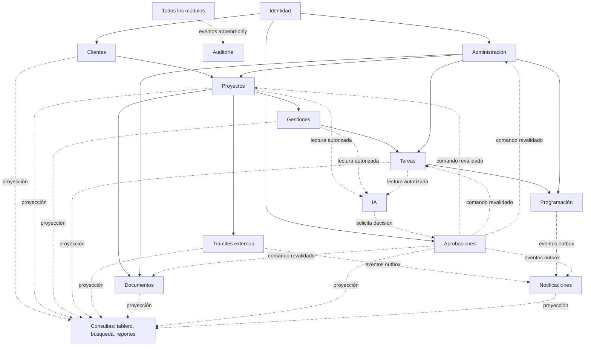

# Límites de módulos y dependencias

Estado: **límites y DAG congelados en Fase 2 el 2026-07-23**

## Módulos propietarios

| Módulo            | Responsabilidad y datos propios                                                                                                    | Contratos que ofrece                                                                                              | Dependencias permitidas                                                                                  |
| ----------------- | ---------------------------------------------------------------------------------------------------------------------------------- | ----------------------------------------------------------------------------------------------------------------- | -------------------------------------------------------------------------------------------------------- |
| Identidad         | usuarios, roles, permisos, especialidades, dispositivos, alcance y revocación                                                      | actor autorizado, comprobación de permiso/alcance                                                                 | Auditoría; adaptador Entra/Supabase                                                                      |
| Clientes          | clientes, contactos y direcciones                                                                                                  | alta/consulta/edición/archivo, referencia de cliente                                                              | contratos de Identidad y Auditoría                                                                       |
| Proyectos         | Proyectos/Contrataciones, Trabajos, participantes, inmuebles/lotes, propiedades, tipo/configuración por Trabajo e historia de tipo | creación manual de Contratación con `1..N` Trabajos, referencia Proyecto/Trabajo, cambio de estado/tipo y archivo | contratos de Clientes, Identidad, Administración y Auditoría                                             |
| Gestiones         | gestiones, notas versionadas, espera, seguimiento y resultado, siempre por Proyecto/Trabajo                                        | ciclo de gestión y vínculo a Trabajo/trámite                                                                      | contratos de Proyectos, Identidad, Administración y Auditoría                                            |
| Tareas            | tareas, subtareas, listas, dependencias, progreso y archivo, siempre por Proyecto/Trabajo                                          | planificación de trabajo y propuestas pendientes                                                                  | contratos de Proyectos, Gestiones, Identidad, Administración y Auditoría                                 |
| Programación      | bloques de ejecución, asignaciones y conflictos                                                                                    | reservar/reprogramar personas y recursos                                                                          | contratos de Tareas, Identidad, Administración y Auditoría; emite eventos para Notificaciones            |
| Trámites externos | trámites APT/SIRI por Trabajo, ejecuciones, texto original, normalización y eventos                                                | fotografía, comparación, actualización y consulta manual de solo lectura                                          | contratos de Proyectos, Identidad y Auditoría; adaptadores externos; emite eventos                       |
| Documentos        | referencias OneDrive por Cliente/Proyecto/Trabajo, plantillas, operaciones, delta y protección                                     | vincular/cargar/mover/renombrar/archivar/restaurar metadatos                                                      | referencias de Clientes/Proyectos; contratos de Identidad, Administración y Auditoría; adaptador Graph   |
| Aprobaciones      | solicitudes, decisiones, revalidación, ejecución e idempotencia                                                                    | solicitar, decidir, invalidar y entregar comando autorizado                                                       | contratos de Identidad y Auditoría; puertos neutrales del objetivo                                       |
| Notificaciones    | avisos, preferencias, dispositivos y suscripciones                                                                                 | solicitar, entregar, leer/marcar y enlace autorizado                                                              | contratos de Identidad y Auditoría; consume outbox; adaptador Web Push                                   |
| IA                | prompts versionados, ejecuciones, evidencia y propuestas                                                                           | resumir/clasificar/proponer sin ejecutar                                                                          | contratos de Identidad/Auditoría, puertos de lectura autorizada y puerto neutral de Aprobaciones; OpenAI |
| Auditoría         | eventos inmutables, correlación e intentos rechazados                                                                              | anexar y consultar/exportar con autorización                                                                      | tipos primitivos de actor/correlación; no depende de implementaciones de otros módulos                   |
| Administración    | catálogos, versiones, plantillas, recursos, políticas y feature flags                                                              | resolver configuración efectiva por versión                                                                       | contratos de Identidad y Auditoría; las acciones sensibles se orquestan externamente con Aprobaciones    |

Tablero, Control General, búsqueda y reportes son **capacidades de consulta/presentación**, no un nuevo propietario de negocio. Consumen proyecciones autorizadas y paginadas de los módulos. Plataforma/operaciones (CI, PWA, respaldo, salud) son capacidades técnicas transversales, no módulos con reglas de proyecto.

## Mapa de dependencias

Las flechas punteadas representan contratos/eventos/proyecciones, no acceso directo a tablas. Aprobaciones no modifica agregados ajenos: entrega un comando firmado con la versión revisada y el módulo propietario revalida y ejecuta. Una referencia operativa a un Trabajo siempre conserva `projectId + workId`; ningún agregado de Contratación fusiona tipos, estados, responsables o historia de sus Trabajos.

Las flechas sólidas forman el DAG de dependencias de compilación en sentido **proveedor estable → consumidor**. Orden topológico propuesto: Auditoría; Identidad; Administración/Clientes/Aprobaciones/Notificaciones/IA; Proyectos; Gestiones/Trámites externos/Documentos; Tareas; Programación. IA depende solo de contratos neutrales y puertos, no de implementaciones de los módulos que consulta.

## Grafo de paquetes congelado

`packages/contracts` es la única raíz compartida. Contiene esquemas Zod, DTO, eventos
y puertos; no contiene entidades persistentes ni adaptadores. Para verificar ciclos,
las aristas siguientes se interpretan como **proveedor → consumidor**:

| Proveedor                                                                            | Consumidores directos permitidos                                                                                                                                  |
| ------------------------------------------------------------------------------------ | ----------------------------------------------------------------------------------------------------------------------------------------------------------------- |
| `contracts`                                                                          | todos los dominios/aplicación; nunca adaptadores como dependencia interna                                                                                         |
| `audit`                                                                              | `identity`, `administration`, `clients`, `approvals`, `notifications`, `ai`, `projects`, `managements`, `tasks`, `scheduling`, `external-procedures`, `documents` |
| `identity`                                                                           | `administration`, `clients`, `approvals`, `notifications`, `ai`, `projects`, `managements`, `tasks`, `scheduling`, `external-procedures`, `documents`             |
| `administration`                                                                     | `projects`, `managements`, `tasks`, `scheduling`, `documents`                                                                                                     |
| `clients`                                                                            | `projects`                                                                                                                                                        |
| `projects`                                                                           | `managements`, `tasks`, `external-procedures`, `documents`, proyecciones autorizadas                                                                              |
| `managements`                                                                        | `tasks`, proyecciones autorizadas                                                                                                                                 |
| `tasks`                                                                              | `scheduling`, proyecciones autorizadas                                                                                                                            |
| `approvals`, `notifications`, `ai`, `external-procedures`, `documents`, `scheduling` | proyecciones/composition root solo mediante contrato o evento                                                                                                     |

No existe una arista desde un consumidor hacia la implementación de su proveedor.
El composition root puede conocer adaptadores concretos, pero no se convierte en
dependencia de dominio. `DEC-0103` no altera este DAG: solo cambia la política que
implementa `AuthorizationPort` y RLS.

## Reglas contra ciclos

1. Los paquetes de dominio no importan aplicación, adaptadores ni presentación.
2. Los módulos solo comparten tipos estables desde `packages/contracts`; no exportan entidades persistentes mutables.
3. Eventos no invocan de vuelta al emisor dentro de la misma transacción.
4. Auditoría recibe registros; no consulta al módulo para reconstruir reglas.
5. Consultas compuestas no ejecutan comandos.
6. Los adaptadores externos implementan puertos definidos hacia adentro.
7. El composition root de Aplicación coordina una acción sensible entre Aprobaciones y el módulo objetivo; ninguno importa la implementación del otro.
8. CI construye el grafo desde manifiestos/imports y falla ante cualquier componente fuertemente conexo de más de un módulo.
9. Los contratos no importan React, Supabase, Graph, OpenAI, APT ni SIRI; los nombres de proveedor solo aparecen en adaptadores.
10. Un contrato transversal de autorización expresa actor, acción y `ResourceScope` discriminado (`organization`, `project` o `work`); los puertos estrictamente operativos conservan `projectId + workId`. El contrato no acepta alcance declarado por el cliente: las capacidades de `DEC-0103` se resuelven desde identidad, roles y membresías persistidos.

## Secuencia de integración

Identidad/Administración/Auditoría/Aprobaciones forman la base transversal; luego Clientes/Proyectos; Gestiones/Tareas/Programación; Documentos y notificaciones; Trámites externos; IA; finalmente consultas/reportes y endurecimiento operativo. La secuencia detallada está en `docs/ai/IMPLEMENTATION_SEQUENCE.md`.
