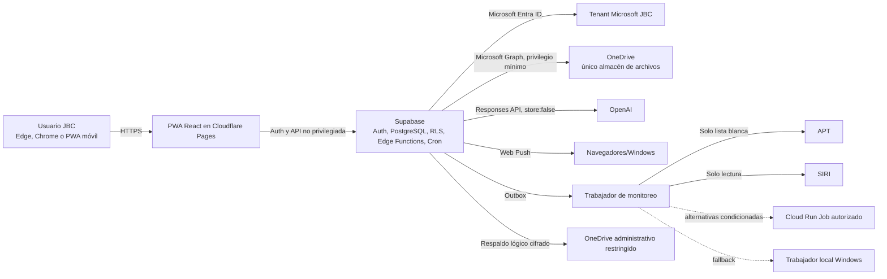
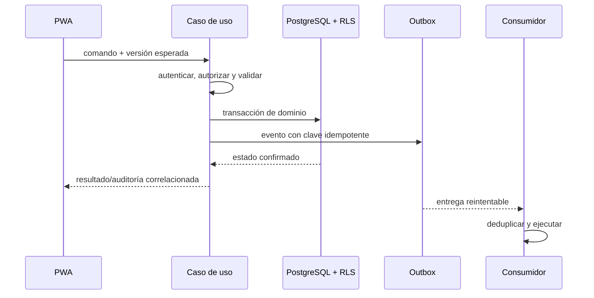

# Visión general del sistema

Estado: **línea base arquitectónica aprobada en G0 el 2026-07-23**

## Propósito y límites

La plataforma es una PWA española para controlar clientes, proyectos, trabajo, agenda, trámites externos, documentos, decisiones y operación de JBC Topografía. Es un **monolito modular**: los módulos comparten despliegue y base, pero cada uno conserva reglas y datos propios mediante Clean Architecture. Las integraciones entran por puertos; el dominio no conoce SDK ni transporte.

No forman parte del sistema: importación de proyectos desde Excel, aplicación móvil nativa, edición completa offline, almacenamiento de binarios en Supabase, escritura APT/SIRI, `permanentDelete`, microservicios, microfrontends, Event Sourcing o CQRS completo.

## Contexto y despliegue objetivo

Cloud Run, Graph con escritura, APT/SIRI reales, Web Push y OpenAI real permanecen detrás de feature flags y sus checkpoints. Los simuladores preceden a cualquier conexión real.

## Capas por módulo

1. **Dominio**: entidades, valores, invariantes y servicios puros.
2. **Aplicación**: casos de uso, autorización funcional, transacciones y emisión de outbox.
3. **Puertos**: repositorios, reloj, identidad, archivos, IA, avisos y fuentes externas.
4. **Adaptadores**: Supabase/PostgreSQL, Graph, OpenAI, APT/SIRI, Push y trabajadores.
5. **Presentación**: React, rutas Data Mode, formularios y vistas responsive.

Dependencias solo apuntan hacia el interior. Un módulo no lee tablas privadas de otro para ejecutar reglas; usa contrato de aplicación, vista autorizada o evento. Las proyecciones de tablero/búsqueda no se convierten en fuente autoritativa.

## Flujo transaccional de referencia

## Capacidades transversales

- **Identidad y RLS**: actor, rol, alcance y revocación.
- **Auditoría**: append-only, correlación y resultado, nunca secretos.
- **Aprobaciones**: solicitud, decisión, revalidación y ejecución separadas.
- **Outbox/idempotencia**: entrega al menos una vez con efectos máximos una vez.
- **Observabilidad**: logs estructurados, salud, frescura y umbrales 70/85 %.
- **Presentación**: estados de carga, vacío, error, permisos, degradación, datos antiguos, offline, éxito y conflicto.

## Restricciones operativas

- Fechas persistidas en UTC; conversión explícita a `America/Costa_Rica`.
- Sin modificación offline ni caché sensible por defecto.
- Binarios nunca atraviesan persistencia Supabase; las cargas usan el adaptador Graph autorizado.
- Trabajadores externos no comparten credenciales entre usuarios y no registran cookies/tokens.
- Una caída de integración no bloquea capacidades independientes.

## Decisiones pendientes que condicionan diseño detallado

La arquitectura aprobada no resuelve aún la matriz fina de alcance/RLS, la política concreta de aprobaciones documentales, la custodia de clave de respaldo ni el destino Cloud Run versus trabajador Windows. El historial APT/SIRI al cambiar tipo y el horario silencioso quedaron resueltos en DEC-0101/0102. Las restantes decisiones están registradas en `docs/ai/DECISIONS_LOG.md` y no se asumirán silenciosamente.
